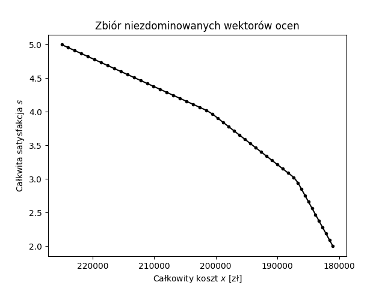
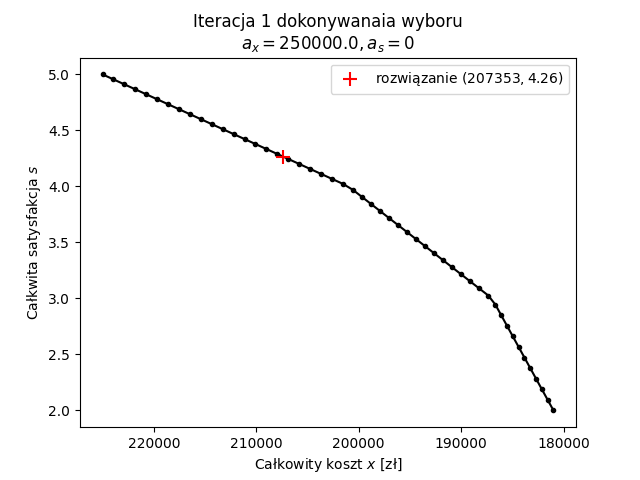
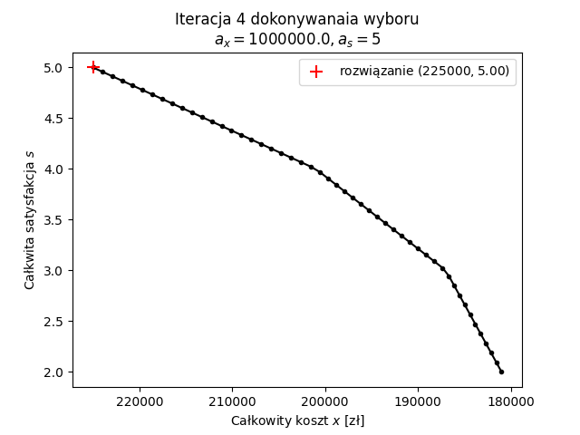

## Model matematyczny zadania

### Ustalenia i założenia

1. Zmienne pomocnicze z prostymi ograniczeniami równościowymi będą zapisywane
   bezpośrednio w sekcji _Zmienne_.
2. W rozwiązaniu rozważana jest tylko sytuacja na jeden miesiąc, więc w domyśle
   wszystkie wartości są w przeliczeniu na miesiąc, np. możliwości produkcyjne
   fabryki na miesiąc, zapotrzebowanie klienta na miesiąc, itp.
3. Zakładam, że zapotrzebowania klientów są możliwe do spełnienia. Gdyby nie
   były, należałoby najpierw rozwiązać problem maksymalnego przepływu.
   Alternatywnie, być może nawet lepszym wyjściem z problemu byłoby dodatkowo
   liczyć zyski ze sprzedaży i zamiast minimalizować koszty dostawy to
   maksymalizować miesięczny profit z działania przedsiębiorstwa.
4. Do znajdywania rozwiązań efektywnych zadania posłużę się metodą punktu
   odniesienia. Zgodnie z jej ,,inżynierską'' implementacją, użyję parametru
   $\epsilon$ jako wagi drugiego z kryteriów (sumy maksymalizowanych wartości)
   maksymalizacji leksykograficznej.
5. Satysfakcję obliczam dla każdego klienta osobno, obliczając część udziału
   dostaw pochodzących od preferowanych dostawców w stosunku do zapotrzebowania
   klienta. Dzięki temu satysfakcja każdego z klientów jest wyrażana liczbą
   rzeczywistą z zakresu $[0, 1]$. Dla klienta 5, który nie ma preferowanego
   dostawcy, satysfakcja wynosi 0.

   Takie podejście ma tę cechę, że traktuje równo każdego z klientów,
   niezależnie od ich zapotrzebowania. Ma to pewien sens, ale niekoniecznie musi
   być odpowiednie we wszystkich warunkach, np. satysfakcja klienta, który
   składa 100 razy większe zamówienia może być bardziej cenna dla
   przedsiębiorstwa niż satysfakcja klienta o mniejszych zapotrzebowaniach na
   produkowany towar. Niemniej jednak w tym konkretnym zadaniu zapotrzebowania
   klientów mają ten sam rząd wielkości, więc uznałem, że takie rozwiązanie
   będzie odpowiednie.

### Zbiory

* $P = \{F1, F2\}$ -- fabryki
* $M = \{M1, M2, M3, M4\}$ -- magazyny
* $K = \{K1, K2, K3, K4, K5, K6\}$ -- klienci
* $E = \{(F1, M1), (F1, M2), (F2, M2), ...\}$ -- połączenia między
  fabrykami/magazynami a magazynami/klientami
* $U = \{(F2, K1), (M1, K2), (M2, K3), ...\}$ -- preferencje klientów (drugi
  element krotki oznacza klienta, a pierwszy preferowanego przez niego dostawcę)
* $T = \{C, S\}$ -- cele optymalizacji (odpowiednio koszty i satysfakcja klientów)

### Parametry

* $g_{p} \quad p \in P$ -- możliwości produkcyjne fabryki $p$ [tona]
* $b_{m} \quad m \in M$ -- maksymalna ilość obsługiwanego towaru magazynu
  $m$ [tona]
* $h_{k} \quad k \in K$ -- zapotrzebowanie klienta $k$ [tona]
* $c_{ij} \quad (i,j) \in E$ -- koszt jednostkowy dystrybucji towaru z węzła $i$
  do $j$  [zł/tona]
* $\epsilon$ -- waga drugiego kryterium w ,,inżynierskiej'' implementacji
  maksymalizacji leksykograficznej
* $\beta$ -- waga dla wartości przekraczających aspiracje w metodzie punktu
  odniesienia [brak jednostki]
* $a_t \quad t \in T$ -- wartość aspiracji celu $t$ w metodzie punktu
  odniesienia [brak jednostki]
* $\lambda_t \quad t \in T$ -- waga celu $t$ w metodzie punktu odniesienia
  [brak jednostki]

### Zmienne

* $f_{ij} \quad (i,j) \in E$ -- przepływ towaru z węzła $i$ do $j$ [tona]
* $s_k \quad k \in K$ -- satysfakcja klienta K [brak jednostki]
* $c^{total} = \sum\limits_{(i,j) \in E} f_{ij} \cdot c_{ij}$ -- całkowity koszt
  dystrybucji [zł]
* $s^{total} = \sum\limits_{k \in K} s_k$ -- całkowita satysfakcja klientów
  [brak jednostki]
* $v_t \quad t \in T$ -- wartość do maksymalizacji dla celu $t$ w metodzie
  punktu odniesienia [brak jednostki]
* $v^{min}$ -- minimalna z wartości do maksymalizacji w metodzie punktu
  odniesienia [brak jednostki]

### Ograniczenia

* $f_{ij} \ge 0 \quad \forall (i,j) \in E$ -- przepływ nieujemny
* $0 \le s_k \le 1 \quad \forall k \in K$ -- satysfakcja w przedziale $[0, 1]$
* $\sum\limits_{(p,j) \in E} f_{pj} \le g_p \quad \forall p \in P$ -- towar
  wychodzący z fabryki $p$ nie może przekroczyć jej maksymalnej produkcji
* $\sum\limits_{(m,j) \in E} f_{mj} \le b_m \quad \forall m \in M$ -- towar
  przepływający przez magazyn $m$ nie może przekroczyć jej maksymalnej ilości
  obsługiwanego towaru
* $\sum\limits_{(i,k) \in E} f_{ik} \ge h_k \quad \forall k \in K$ -- towar
  dostarczany do klienta $k$ musi pokryć jego zapotrzebowanie
* $\sum\limits_{(i,w) \in E} f_{iw} = \sum\limits_{(w,j) \in E} f_{wj} \quad \forall w \in W$
  -- towar wpływający do magazynu musi go w całości opuścić do końca miesiąca
* $\sum\limits_{(i,k) \in U} \frac{f_{ik}}{h_k} \ge s_k \quad \forall k \in K$
  -- obliczanie satysfakcji dla klienta $k$ zgodnie z założeniem 5
* ograniczenia z metody punktu odniesienia:
  * $v_C \le -\lambda_C (c^{total} - a_C)$ -- obliczanie $v_C$ dla kosztów powyżej
    aspiracji (znak minus, ponieważ minimalizujemy ryzyko)
  * $v_C \le -\beta \lambda_C (c^{total} - a_C)$ -- obliczanie $v_C$ dla kosztów
    poniżej aspiracji (znak minus, ponieważ minimalizujemy ryzyko)
  * $v_S \le \lambda_S (s^{total} - a_S)$ -- obliczanie $v_S$ dla satysfakcji
    poniżej aspiracji
  * $v_S \le \beta \lambda_S (s^{total} - a_S)$ -- obliczanie $v_S$ dla
    satysfakcji powyżej aspiracji
  * $v^{min} \le v_t \quad \forall t \in T$ -- minimalna z wartości do
    maksymalizacji mniejsza od każdej z tych wartości

### Funkcja celu

$$lexmax \ (f^{min}, \epsilon \sum\limits_{t \in T} f_t)$$

Funkcja celu dla metody punktu odniesienia: maksymalizacja w pierwszej
kolejności minimum z wartości, a w drugiej kolejności sumy wszystkich wartości $v_t$.

Funkcja $lexmax$ jest realizowana metodą ,,inżynierską'' w następujący sposób:

$$\max \ f^{min} + \epsilon \sum\limits_{t \in T} f_t$$

## Wyniki optymalizacji

Powyższy model został zaimplementowany w języku AMPL i uruchomiony przy użyciu
solwera CPLEX. Implementacja znajduje się w plikach: `src/proj3.{dat,mod,run}`.

### Rozwiązanie efektywne minimalnego kosztu

Zostało wyznaczone dla parametrów:

* $\epsilon = 0.000001$ -- wyznaczony eksperymentalnie tak, by drugie kryterium
  nie zakłócało działania pierwszego
* $\beta = 0.1$ -- w tym zastosowaniu nie ma dużo znaczenia, bo i tak zawsze
  wartości aspiracji są nieosiągalne
* $\lambda_S = 10000$, $\lambda_Z = 1$ -- tak ustawione wagi mniej więcej
  zrównują rzędami wielkości koszty i satysfakcję; bez tego metoda miałaby
  tendencję do poprawiania tylko jednego z kryteriów, a nawet mogłaby nie
  działać zgodnie z oczekiwaniami
* $a_C = 0, a_S = 0$ -- wartość $a_S$ jest osiągnięta dla każdego dopuszczalnego
  rozwiązania, więc metoda będzie tylko minimalizowała koszty

Wartości zmiennych:

* $f_{ij} \quad (i,j) \in E$ -- przepływ towaru z węzła $i$ do $j$ [tona]

  | $j$\\$i$ | F1    | F2    | M1    | M2    | M3    | M4  |
  |:--------:|:-----:|:-----:|:-----:|:-----:|:-----:|:---:|
  | M1       | 60000 | -     |       |       |       |     |
  | M2       | 0     | 50000 |       |       |       |     |
  | M3       | 0     | 20000 |       |       |       |     |
  | M4       | 0     | 0     |       |       |       |     |
  | K1       | 0     | 50000 | -     | 0     | -     | -   |
  | K2       | -     | -     | 0     | 10000 | 0     | -   |
  | K3       | 0     | -     | 40000 | 0     | 0     | 0   |
  | K4       | 35000 | -     | 0     | 0     | -     | 0   |
  | K5       | -     | -     | -     | 40000 | 20000 | 0   |
  | K6       | 0     | -     | 20000 | -     | 0     | 0   |

* $s_k \quad k \in K$ -- satysfakcja klienta K [brak jednostki]
  
  | $.$\\$k$ | $K1$ | $K2$ | $K3$ | $K4$ | $K5$ | $K6$ |
  |:--------:|:----:|:----:|:----:|:----:|:----:|:----:|
  | $s_k$    | 1    | 0    | 0    | 1    | 0    | 0    |

Wartości w przestrzeni kryteriów:

* $c^{total} = 181000$ -- całkowity koszt dystrybucji [zł]
* $s^{total} = 2$ -- całkowita satysfakcja klientów [brak jednostki]

### Rozwiązanie efektywne maksymalnej satysfakcji

Zostało wyznaczone dla parametrów:

* $\epsilon = 0.000001$ -- wyznaczony eksperymentalnie tak, by drugie kryterium
  nie zakłócało działania pierwszego
* $\beta = 0.1$ -- w tym zastosowaniu nie ma dużo znaczenia, bo i tak zawsze
  wartości aspiracji są nieosiągalne
* $\lambda_S = 10000$, $\lambda_Z = 1$ -- tak ustawione wagi mniej więcej
  zrównują rzędami wielkości koszty i satysfakcję; bez tego metoda miałaby
  tendencję do poprawiania tylko jednego z kryteriów, a nawet mogłaby nie
  działać zgodnie z oczekiwaniami
* $a_C = 1000000, a_S = 5$ -- tym razem wartość $a_C$ jest osiągnięta dla każdego
  dopuszczalnego rozwiązania, więc metoda będzie tylko maksymalizowała
  satysfakcję

Wartości zmiennych:

* $f_{ij} \quad (i,j) \in E$ -- przepływ towaru z węzła $i$ do $j$ [tona]

  | $j$\\$i$ | F1    | F2    | M1    | M2    | M3    | M4  |
  |:--------:|:-----:|:-----:|:-----:|:-----:|:-----:|:---:|
  | M1       | 10000 | -     |       |       |       |     |
  | M2       | 0     | 50000 |       |       |       |     |
  | M3       | 0     | 70000 |       |       |       |     |
  | M4       | 0     | 0     |       |       |       |     |
  | K1       | 0     | 50000 | -     | 0     | -     | -   |
  | K2       | -     | -     | 10000 | 0     | 0     | -   |
  | K3       | 0     | -     | 0     | 40000 | 0     | 0   |
  | K4       | 35000 | -     | 0     | 0     | -     | 0   |
  | K5       | -     | -     | -     | 10000 | 50000 | 0   |
  | K6       | 0     | -     | 0     | -     | 20000 | 0   |

* $s_k \quad k \in K$ -- satysfakcja klienta K [brak jednostki]
  
  | $.$\\$k$ | $K1$ | $K2$ | $K3$ | $K4$ | $K5$ | $K6$ |
  |:--------:|:----:|:----:|:----:|:----:|:----:|:----:|
  | $s_k$    | 1    | 1    | 1    | 1    | 0    | 1    |

Wartości w przestrzeni kryteriów:

* $c^{total} = 225000$ -- całkowity koszt dystrybucji [zł]
* $s^{total} = 5$ -- całkowita satysfakcja klientów [brak jednostki]

#### Zbiór rozwiązań efektywnych

W celu wyznaczenia zbioru rozwiązań efektywnych w przestrzeni ryzyko-zysk,
uruchomiłem model dla 50 różnych par wartości aspiracji $(a_C, a_S)$. Wartości
aspiracji zostały spróbkowane równomiernie z przedziałów odpowiednio:

* $a_C \in [181000, 225000]$
* $a_S \in [2, 5]$

, których krańce zostały wybrane z wyników poprzednich dwóch zadań, dzięki czemu
otrzymane rezultaty w przybliżeniu powinny pokryć cały obszar niezdominowanych
wektorów ocen.

Reszta parametrów była taka jak w poprzednich zadaniach:

* $\epsilon = 0.000001$ -- wyznaczony eksperymentalnie tak, by drugie kryterium
  nie zakłócało działania pierwszego
* $\beta = 0.1$ -- w tym zastosowaniu nie ma dużo znaczenia, bo i tak zawsze
  wartości aspiracji są nieosiągalne
* $\lambda_S = 10000$, $\lambda_Z = 1$ -- tak ustawione wagi mniej więcej
  zrównują rzędami wielkości koszty i satysfakcję; bez tego metoda miałaby
  tendencję do poprawiania tylko jednego z kryteriów, a nawet mogłaby nie
  działać zgodnie z oczekiwaniami

Fragment wyników eksperymentu w przestrzeni kryteriów:

| $a_C$  | $a_S$ | $c^{total}$ | $s^{total}$ | | $a_C$  | $a_S$ | $c^{total}$ | $s^{total}$ |
|--------|-------|-------------|-------------|-|--------|-------|-------------|-------------|
| 181000 | 2.00  | 181000      | 2.00        | | 216020 | 4.39  | 214340      | 4.56        |
| 181898 | 2.06  | 181566      | 2.09        | | 216918 | 4.45  | 215406      | 4.60        |
| 182796 | 2.12  | 182133      | 2.19        | | 217816 | 4.51  | 216472      | 4.64        |
| 183694 | 2.18  | 182699      | 2.28        | | 218714 | 4.57  | 217538      | 4.69        |
| 184592 | 2.24  | 183265      | 2.38        | | 219612 | 4.63  | 218604      | 4.73        |
| 185490 | 2.31  | 183832      | 2.47        | | 220510 | 4.69  | 219670      | 4.78        |
| 186388 | 2.37  | 184398      | 2.57        | | 221408 | 4.76  | 220736      | 4.82        |
| 187286 | 2.43  | 184964      | 2.66        | | 222306 | 4.82  | 221802      | 4.87        |
| 188184 | 2.49  | 185531      | 2.76        | | 223204 | 4.88  | 222868      | 4.91        |
| 189082 | 2.55  | 186097      | 2.85        | | 224102 | 4.94  | 223934      | 4.96        |
| ...    | ...   | ...         | ...         | | 225000 | 5.00  | 225000      | 5.00        |

<!--
| 189980 | 2.61  | 186663      | 2.94        |
| 190878 | 2.67  | 187357      | 3.03        |
| 191776 | 2.73  | 188238      | 3.09        |
| 192673 | 2.80  | 189119      | 3.15        |
| 193571 | 2.86  | 190000      | 3.21        |
| 194469 | 2.92  | 190881      | 3.28        |
| 195367 | 2.98  | 191762      | 3.34        |
| 196265 | 3.04  | 192643      | 3.40        |
| 197163 | 3.10  | 193524      | 3.47        |
| 198061 | 3.16  | 194405      | 3.53        |
| 198959 | 3.22  | 195286      | 3.59        |
| 199857 | 3.29  | 196167      | 3.65        |
| 200755 | 3.35  | 197048      | 3.72        |
| 201653 | 3.41  | 197929      | 3.78        |
| 202551 | 3.47  | 198810      | 3.84        |
| 203449 | 3.53  | 199690      | 3.91        |
| 204347 | 3.59  | 200571      | 3.97        |
| 205245 | 3.65  | 201547      | 4.02        |
| 206143 | 3.71  | 202613      | 4.07        |
| 207041 | 3.78  | 203679      | 4.11        |
| 207939 | 3.84  | 204745      | 4.16        |
| 208837 | 3.90  | 205812      | 4.20        |
| 209735 | 3.96  | 206878      | 4.24        |
| 210633 | 4.02  | 207944      | 4.29        |
| 211531 | 4.08  | 209010      | 4.33        |
| 212429 | 4.14  | 210076      | 4.38        |
| 213327 | 4.20  | 211142      | 4.42        |
| 214224 | 4.27  | 212208      | 4.47        |
| 215122 | 4.33  | 213274      | 4.51        |
-->

Następnie otrzymane wyniki naniosłem na wykres. Na wykresie odwróciłem oś OX,
żeby kierunek optymalizacji był skierowany intuicyjnie, w stronę pierwszej
ćwiartki układu współrzędnych (koszt jest minimalizowany).

Widać, że żadne z wyliczonych rozwiązań nie dominuje żadnego innego, co
sugeruje, że zadanie się udało.

#### Symulacja podejmowania decyzji

W tym prostym zadaniu najlepiej byłoby podjąć decyzję patrząc bezpośrednio na
wykres zbioru wektorów ocen niezdominowanych. Niestety w realnych problemach
zazwyczaj sporządzenie takiego wykresu byłoby niemożliwe ze względu na zbyt dużą
wymiarowość. Nawet wykresy 3D sprawiają człowiekowi trudności w prawidłowej
interpretacji przez to, że widać na raz tylko jeden rzut przestrzeni, a
podejmowanie decyzji na podstawie wykresu 4D jest już nierealistyczne.

Dzięki zastosowanej metodzie punktu odniesienia decydent może wybierać
manipulować wektorem aspiracji w poszukiwaniu najbardziej odpowiedniego
rozwiązania, a zwracane rozwiazania mają gwarancję bycia efektywnymi.

W poniższym przykładzie oprócz wartości ocen zwracanych przez model, będę
pokazywał także wykresy wraz z rozwiązaniami efektywnymi w przestrzeni
koszt-satysfakcja dla lepszego zrozumienia problemu, jednak należy być przy tym
świadomym powyższych uwag.

Kroki symulacji podejmowania decyzji:

1. Na podstawie wstępnych obliczeń decydent wie, że wydanie więcej niż 250000 zł
   będzie nierentowne. Na początek nie ma oczekiwań co do satysfakcji klientów,
   jest to w tym momencie mniej istotna sprawa.

   * aspiracje: $a_C = 250$ tyś. zł, $a_S=0$
   * wynik: $c^{total} = 207$ tyś zł, $s^{total}=4.26$

   

2. Okazało się, że biznes ma szanse być rentowny, co zadowoliło decydenta.
   Jednak ponieważ decydenta interesuje zarabianie dużych pieniędzy, to chce
   zobaczyć jak bardzo jest w stanie obciąć koszy i obniża aspirację kosztów do
   zera.

   * aspiracje: $a_C = 0$ tyś zł, $a_S=0.00$
   * wynik: $c^{total} = 181$ tyś zł, $s^{total}=2.00$

   
3. Decydent omal nie zemdlał z zachwytu. Tak niskie koszta będą oznaczały
   gigantyczne zyski dla jego firmy. Mimo wszystko pomyślał, że może rozwiązanie
   pośrednie będzie lepszym wyjściem, gdzie oddając trochę zysków zyska trochę
   zadowolenia klientów. Wybiera aspiracje pomiędzy dwoma powyższymi rozwiązaniami.

   * aspiracje: $a_C = 190$ tyś zł, $a_S=3.00$
   * wynik: $c^{total} = 189$ tyś zł, $s^{total}=3.12$

   
4. Decydent jest pod wrażeniem swoich umiejętności decyzyjnych z uwagi na to, że
   trafił tak blisko rozwiązania efektywnego. Jednak gdy ma już kończyć swoją
   krótką sesję podejmowania decyzji, nachodzi go jego doświadczony w
   prowadzeniu firmy ojciec, który mówi że jego wybór jest krótkowzroczny.
   Prawdziwy, długofalowy sukces osiągnie jedynie dbając o zadowolenie swoich
   klientów. Decydent po chwili namysłu niechętnie przyjmuje do wiadomości radę
   ojca i sprawdza ile by go kosztowało maksymalne zwiększenie satysfakcji
   klientów, ustawiając aspirację kosztów na bardzo dużą liczbę, a aspirację
   satysfakcji na maksymalną wartość.

   * aspiracje: $a_C = 1000$ tyś zł, $a_S=5.00$
   * wynik: $c^{total} = 225$ tyś zł, $s^{total}=5.00$

   
5. Ojciec chwali mądrość swojego syna i wychodzi z pokoju, by zająć się
   oglądaniem telewizji. Po jego wyjściu syn nie mogąc znieść wizji miernych
   zysków ze swojej inwestycji postanawia w samotności, że najlepszy będzie
   kompromis. Ustawia aspirację na wartości pomiędzy tymi z drugiej i czwartej
   iteracji.

   * aspiracje: $a_C = 200$ tyś zł, $a_S=3.00$
   * wynik: $c^{total} = 198$ tyś zł, $s^{total}=3.75$

   
6. Decydent jest w miarę usatysfakcjonowany rozwiązaniem. Postanawia jednak nie
   dzielić się swoją ostateczną decyzją z ojcem.
